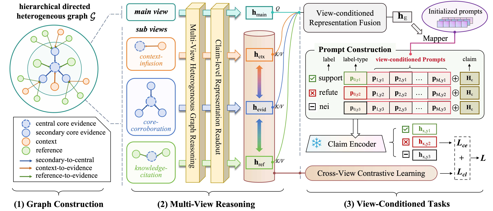

# HeterMV: Multi-View Reasoning over Source-Aware Heterogeneous Evidence Graph

[](https://opensource.org/licenses/MIT)
[](https://doi.org/10.1016/j.ipm.2026.104709)

This repository provides the official implementation of **HeterMV** — a novel framework for multi-source fact verification that performs **multi-view reasoning over a source-aware heterogeneous evidence graph**.

> **Paper**: HeterMV: Multi-view reasoning over source-aware heterogeneous evidence graph for multi-source fact verification  
> **DOI**: [10.1016/j.ipm.2026.104709](https://doi.org/10.1016/j.ipm.2026.104709)

---

## 1. Overview

HeterMV is a source-aware multi-view reasoning framework for multi-source fact verification. It organizes core evidence, context, and reference documents into a heterogeneous evidence graph, performs view-specific reasoning over different evidence relations, and enhances claim verification through view-conditioned prompt tuning and cross-view consistency learning.


## 2. Repository Structure

```
data/                    # Dataset directory
data_loader.py           # Data loading & preprocessing
encoder.py               # Encoder + heterogeneous graph reasoning
decoder.py               # Classification & loss functions
evaluation.py            # Metrics (F1, accuracy)
model.py                 # Model wrapper (encoder + decoder)
main.py                  # Training / inference entrypoint
README.md
```

---

## 3. Data Preparation

Datasets should be placed under:

```
./data/<dataset_name>/
```

### Required Files

* `claims.json`
* `evidence.json`
* `contexts.json`
* `references.json`

📩 Dataset will be made available on request. Please contact **[gujunnandaniel@gmail.com](mailto:gujunnandaniel@gmail.com).**

---

## 4. Installation

Install dependencies:

```bash
pip install torch torchvision torchaudio
pip install transformers
pip install torch-geometric torch-scatter torch-sparse torch-cluster torch-spline-conv
pip install scikit-learn tqdm
```

---

## 5. Training

```bash
# check_covid
python main.py -m supervised -es retrieved -ml 128 -gpu 0 -ne 100 -ls 5

# feverous-s
python main.py -m supervised -es retrieved -ml 128 -gpu 0 -ne 100 -ls 5 -lm base_bert -dn feverous
```

---

### Key Arguments

| Argument                   | Description                                     |
| -------------------------- | ----------------------------------------------- |
| `--dataset_name`           | Dataset folder name                             |
| `--mode`                   | supervised / test                    |
| `--evidence_setting`       | gold / retrieved                                |
| `--language_model`         | base_bert / pubmed_bert |
| `--num_prompt_embs`        | Prompt length                                   |
| `--num_sampled_evidence`   | Evidence per claim                              |
| `--num_sampled_references` | References per evidence                         |

---

## 6. Evaluation

```bash
python main.py \
  --dataset_name check_covid \
  --mode test \
  --language_model pubmed_bert
```

Default checkpoint:

```
./ckpt/<dataset>_<setting>_supervised_<lm>.pt
```

---

## 7. Outputs

* Checkpoints → `./ckpt/`
* Logs → `./log.txt`

---

## 8. Citation

If you find this work useful, please cite:

```bibtex
@article{gu2026hetermv,
  title={HeterMV: Multi-view reasoning over source-aware heterogeneous evidence graph for multi-source fact verification},
  author={Gu, Junnan and Li, Weimin and Liu, Fangfang and Liu, Wei and Wang, Hao},
  journal={Information Processing \& Management},
  volume={63},
  number={5},
  pages={104709},
  year={2026},
  publisher={Elsevier}
}
```
